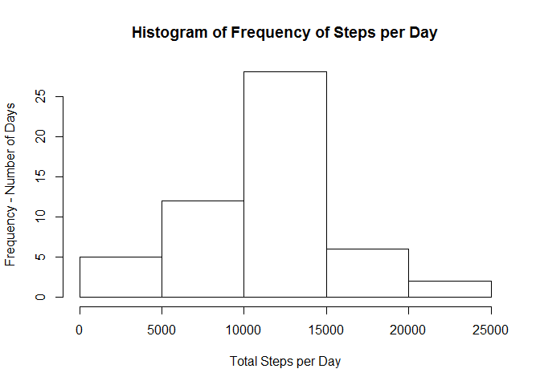
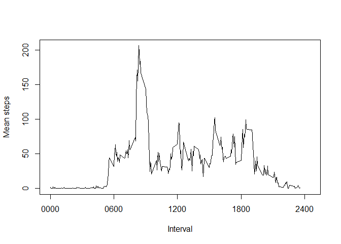
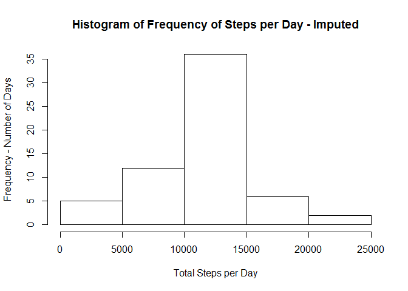
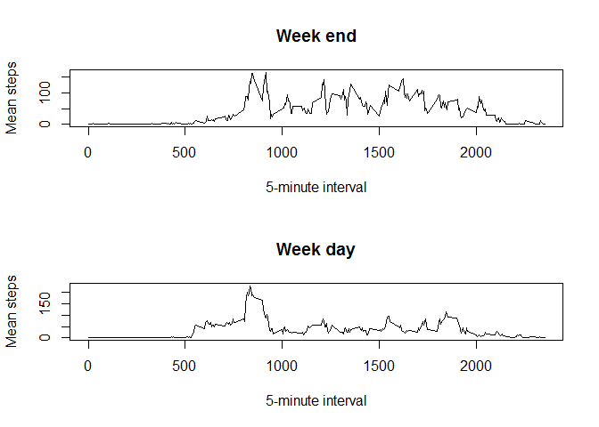

# Reproducible Research: Peer Assessment 1


## Loading and preprocessing the data

```r
#Unzip and Read CSV
myData <- read.csv(unz("activity.zip","activity.csv"))
#Check Contents
#head(myData)
```


## What is mean total number of steps taken per day?
### 1. Histogram

```r
#SUmmarise Data - Total steps per day ignoring NA values
myDataSummary <- aggregate(steps ~ date,data=myData,sum,na.rm=TRUE)
hist(myDataSummary[,2],xlab="Total Steps per Day",ylab="Frequency - Number of Days",main="Histogram of Frequency of Steps per Day")
```

 

```r
#Calculate and store mean
iMean<-mean(myDataSummary[,2])
#Calculate and store median of total steps per days
iMedian<-median(myDataSummary[,2])
```
###2. Report mean and Median of Steps per day
Mean steps per day: 10766.189

Median steps per day: 10765


## What is the average daily activity pattern?
### 1. Time Series Plot

```r
#SUmmarise Data - Mean steps per 5 minute interval ignoring NA values
myDataSummary2 <- aggregate(steps ~ interval,data=myData,mean,na.rm=TRUE)
plot(myDataSummary2[,1],myDataSummary2[,2],type="l",xlab="Interval",ylab="Mean steps",xlim=c(0, 2450),xaxt="n" )
axis(1,at=c(0000,0600,1200,1800,2400),labels=c('0000','0600','1200','1800','2400'))
```

 

```r
iMaxStepsInterval<-myDataSummary2[myDataSummary2$steps==max(myDataSummary2$steps),1]
```
### 2. Interval with highest mean number of steps
Interval: 0835

## Imputing missing values
Basic stratgey is to get the intervals with step data that is missing. Then merge this with the means for these intervals. Take this dataset and add it into the original dataset that had no missing fields.

```r
iNAVals <- sum(is.na(myData$steps))
## I Create a DF with just the NAS
dfNA<-myData[is.na(myData$steps),]
## now Merge this one onto my intervals mean frame
dfNA<-merge(x=dfNA,y=myDataSummary2,by="interval",all.x=TRUE)
##Now hack this back into original df - note column ordering
dfNA<-dfNA[,c(4,3,1)]
#set the names to match
names(dfNA)<- names( myData ) 
##Now merge back into original data set
dImputed<-rbind(dfNA,myData[!is.na(myData$steps),])

#SUmmarise Data - Total steps per day ignoring NA values
dImputedSummary <- aggregate(steps ~ date,data=dImputed,sum,na.rm=TRUE)
hist(dImputedSummary[,2],xlab="Total Steps per Day",ylab="Frequency - Number of Days",main="Histogram of Frequency of Steps per Day - Imputed")
```

 

```r
#Calculate and store mean
iMeanI<-mean(dImputedSummary[,2])
#Calculate and store median of total steps per days
iMedianI<-median(dImputedSummary[,2])
```
Mean steps per day: 10766.189

Median steps per day: 10766.189


## Are there differences in activity patterns between weekdays and weekends?

```r
myDataWeekends<-cbind(dImputed,weekdays(as.POSIXlt(dImputed[,2])))
names(myDataWeekends)<-c('steps','date','interval','weekday')
myWeekends<-myDataWeekends[myDataWeekends$weekday=="Sunday" | myDataWeekends$weekday=="Saturday",]
myDataWeekends$daytype <- as.factor(ifelse(myDataWeekends$weekday=="Sunday" | myDataWeekends$weekday=="Saturday","weekend", "weekday"))

dWeekdays<-myDataWeekends[myDataWeekends$daytype=='weekday',]
dWeekEnd<-myDataWeekends[myDataWeekends$daytype=='weekend',]
dWeekdaysSummary<-aggregate(steps~interval,data=dWeekdays,FUN=mean)
dWeekEndSummary<-aggregate(steps~interval,data=dWeekEnd,FUN=mean)

par(mfrow=c(2,1))
plot(dWeekEndSummary,type="l",main="Week end",xlab="5-minute interval",ylab="Mean steps")
plot(dWeekdaysSummary,type="l",main="Week day",xlab="5-minute interval",ylab="Mean steps")
```

 
